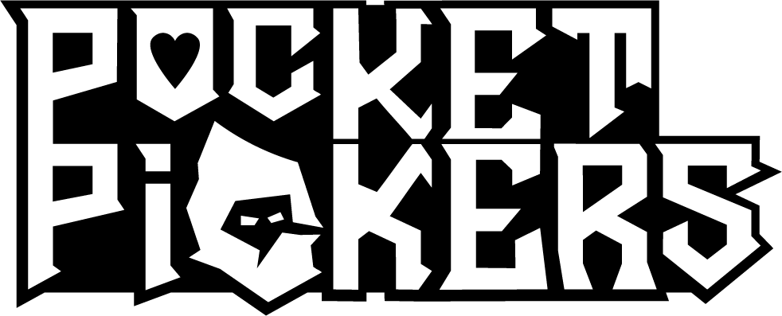
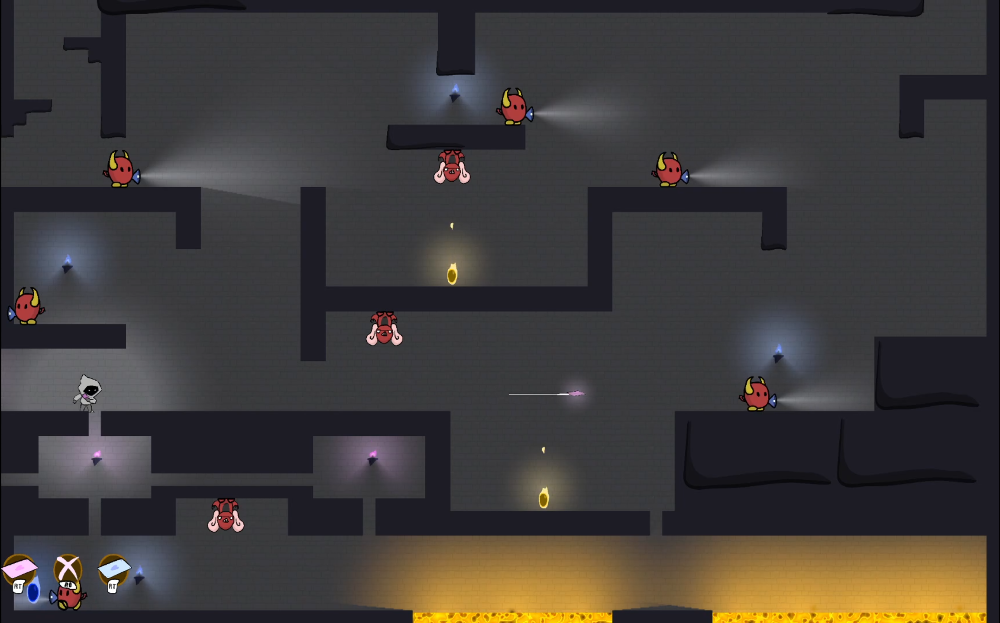
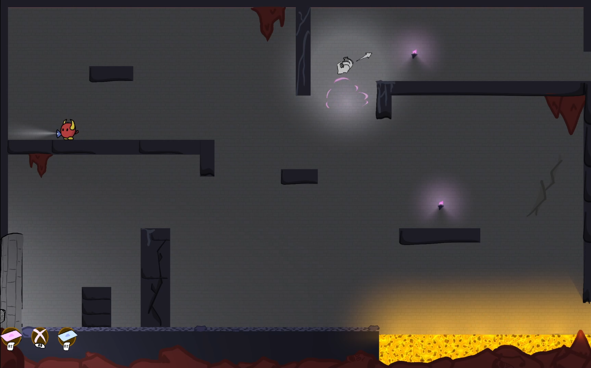

# Pocket Pickers

**Pocket Pickers** is an award-winning stealth-action platformer developed in Unity as a senior capstone project at CSUMB.  
Play as a bank robber trapped in hell, breaking into the underworld's vault to reclaim your sins and escape your eternal punishment.

> 🏆 **CSUMB Fall 2024 Capstone Project Award:** 
> *Best Computer Design & Computer Science Integrated Project*

## 🕹️ Gameplay Overview

You'll use a magic playing card that can be thrown, bounced off walls, and teleported to — the cornerstone of both movement and strategy.

- 🎯 **Throw & teleport** to a magical card to traverse and outwit enemies
- 😈 **Avoid sinfully violent behavior** — attacking enemies makes the game harder
- 🔥 **Collect your sins** and escape Hell’s vault, but beware: the more you carry, the stronger the guards become
- 💀 **Multiple runs encouraged** — make strategic trips to reclaim your soul one piece at a time

A careful balance of stealth, mobility, and risk defines your path to redemption.

---

## 🎯 Objective

Your mission is to locate and collect glowing **sin objects** hidden throughout each level and return them to the exit.  
Every sin increases difficulty — enemies get faster, more aware, and your stealth options narrow. Plan carefully:

- 🏃‍♂️ Go for a few sins at a time to play it safe  
- 🪙 Or risk a large trip to save time... but raise the stakes

Master teleportation, avoid unnecessary violence, and escape Hell!

---

## 🎮 Controls

> _Supports Steam Deck, Xbox, and PlayStation controllers_  
> Controls use analogous buttons across all controller types.

### 🧍 Movement

| Action       | Input                          |
|--------------|--------------------------------|
| Move         | Left joystick                  |
| Jump         | A (Xbox / Steam Deck), X (PS)  |
| Dash         | B (Xbox / Steam Deck), O (PS)  |

---

### 🃏 Card Mechanics

| Action              | Input                        |
|---------------------|------------------------------|
| **Aim**             | Right joystick               |
| **Throw**           | RT (Xbox), R2 (PS / Deck)    |
| **Teleport**        | Press throw button again     |
| **Cancel**          | RB (Xbox), R1 (PS / Deck)    |
| **False Trigger**   | Activate burst (LT (Xbox), L2 (PS / Deck) ) to distract enemies without generating sin |

> 🧠 Cards bounce up to 2 times and can be recalled or exploded to distract enemies.

---

### 🧟 Additional Actions

| Action     | Description |
|------------|-------------|
| **Escape** | Wiggle joysticks when grabbed by enemies |
| **Strike** | Hit enemies with the card to disable them (⚠️ adds sin to the vault!) |

---

## 🧪 Tech Stack

- **Engine:** Unity 2022.3.46f1
- **Art:** Adobe Suite

---

## 👥 Team

- Micah Rodriguez (Lead Design)
- Josh Dickerman (Programmer)
- Noel Hann (Programmer)

---

## 📸 Screenshots

  
  

---

## 🧠 Design Notes

- Focus on **player agency** through skillful use of teleport mechanics
- Stealth emphasis — avoid being seen, create distractions, and outmaneuver patrols
- Dynamic difficulty system based on player behavior (sin count, violence)

---

### 🔮 Future Plans

Complete overhaul with more enemies, unique mechanics, boss encounters, puzzles, and more coming soon!

---
